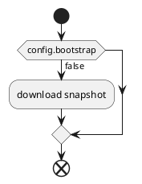
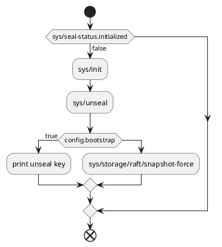
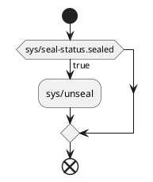

# How does it work?

## Configuration

The following configuration parameters can be specified as commandline arguments or environment variables.
If they are not provided, then the user will be prompted for them if and when they are required.

| name              | default value |                                                        |
|-------------------|---------------|--------------------------------------------------------|
| vault-api-host    | localhost     |                                                        |
| vault-api-port    | 8200          |                                                        |
| bootstrap         | false         | Set to create a new, empty Vault                       |
| snapshot-url      |               | URL for downloading the snapshot                       |
| snapshot-username |               | Username or access key ID for downloading snapshot     |
| snapshot-password |               | Password or secret access key for downloading snapshot |
| unseal-key        |               |                                                        |

## Sequence

This following sequences are run in order.

### Download snapshot

### Initialize

It connects to the Vault server API endpoint.

If the server is not initialized, it initializes it from scratch.
This is necessary even if not bootstrapping a new Vault.

If not bootstrapping a new Vault,
it follows the [Standard Procedure for Restoring a Vault Cluster - Single Vault Cluster](https://developer.hashicorp.com/vault/tutorials/standard-procedures/sop-restore#single-vault-cluster).

### Unseal

